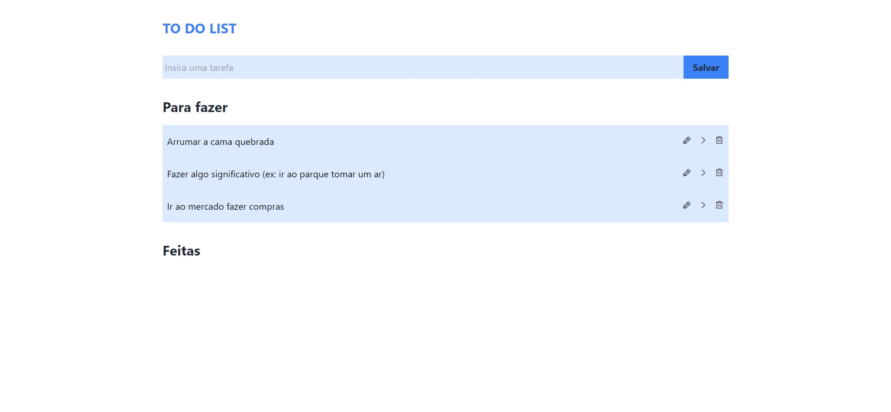

# To Do List With Tailwind 
 

A to-do list created with tailwindCss to learn more about this tool

[Acesse aqui o site](https://ericodesenvolvedor.github.io/to-do-list-with-tailwind/)

### How to use?

1. In input, write your task and click in button for save the 
task.
2. Created, now your can use the functionality of edit, move and delete.
3. Edit: to Clicking in pencil icon, the input will have a value equal to task created by you. You can to edit and save a new value.
4. Move: Clicking the right arrow icon, your task will moved to the group finished tasks or clicking in arrow left, your task goes moved to the group to do.
5. Delete: Clicking in trash icon, you go remove your task.

### Stack ⚙️ 

- HTML 
- CSS
- Figma
- TailwindCss

### Responsive 📱 

- Resposive layout.

Created with :heart: by 
  <a href="https://github.com/Ericodesenvolvedor">ericodesenvolvedor</a>

 
